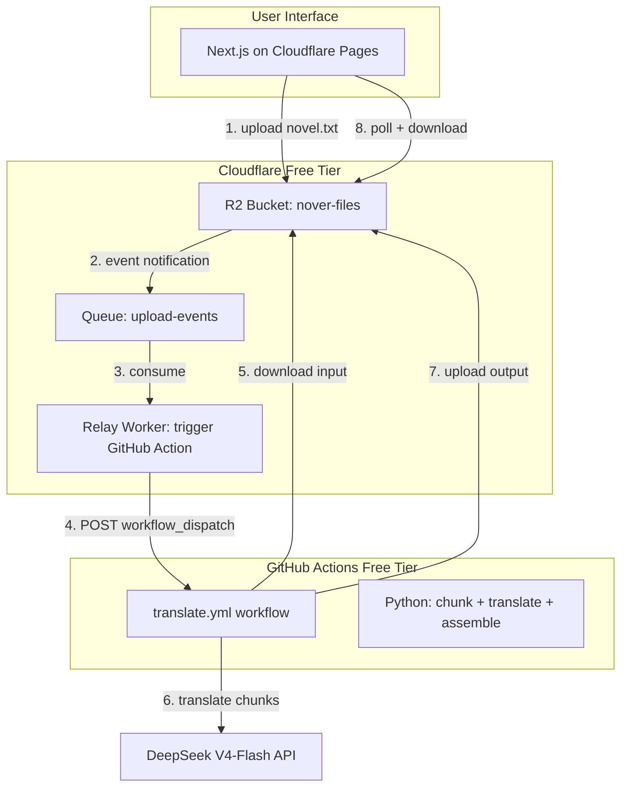

# R2 + GitHub Actions Translation Pipeline

## Architecture



## Step-by-Step Flow

1. **User uploads** `novel.txt` (up to 9 MB) via frontend -> R2 (`input/{job_id}/novel.txt`)
2. **R2 Event Notification** fires on object creation (prefix filter: `input/`)
3. **Queue** delivers event to **Relay Worker**
4. **Relay Worker** extracts the R2 key and calls GitHub API:
   `POST /repos/{owner}/nover/actions/workflows/translate.yml/dispatches`
   with `inputs: { r2_key, job_id }`
5. **GitHub Action** runner spins up (~30s), runs Python script:
   - Downloads input file from R2 (S3-compatible API)
   - Writes status marker to R2: `status/{job_id}.json` (`{"status": "running", ...}`)
   - Chunks file in memory (3,000 chars/chunk -> ~1,000 chunks)
   - Translates all chunks via DeepSeek (5 concurrent async calls, ~50 min)
   - Periodically updates status in R2 (progress %)
   - Assembles final output
   - Uploads to R2: `output/{job_id}/translated.txt`
   - Writes final status: `{"status": "completed", "output_key": "..."}`
6. **Frontend** polls `status/{job_id}.json` in R2 for progress
7. **User downloads** translated file from R2 via frontend

## Component Details

### 1. Relay Worker (~15 lines)

The entire Worker:

```typescript
interface Env {
  GH_TOKEN: string;
  GH_REPO: string;
}

export default {
  async queue(batch: MessageBatch, env: Env): Promise<void> {
    for (const msg of batch.messages) {
      const event = msg.body as { object: { key: string } };
      const key = event.object.key;

      // Extract job_id from key pattern: input/{job_id}/novel.txt
      const jobId = key.split("/")[1];
      if (!jobId) { msg.ack(); continue; }

      await fetch(
        `https://api.github.com/repos/${env.GH_REPO}/actions/workflows/translate.yml/dispatches`,
        {
          method: "POST",
          headers: {
            Authorization: `Bearer ${env.GH_TOKEN}`,
            "Content-Type": "application/json",
            "User-Agent": "nover-relay",
          },
          body: JSON.stringify({
            ref: "main",
            inputs: { r2_key: key, job_id: jobId },
          }),
        }
      );
      msg.ack();
    }
  },
};
```

CPU: <1ms. Queue ops: 2 per upload. Negligible free tier usage.

### 2. GitHub Action Workflow (`.github/workflows/translate.yml`)

```yaml
name: Translate Novel
on:
  workflow_dispatch:
    inputs:
      r2_key:
        description: R2 object key of input file
        required: true
      job_id:
        description: Job ID for status tracking
        required: true

jobs:
  translate:
    runs-on: ubuntu-latest
    timeout-minutes: 300
    env:
      AWS_ACCESS_KEY_ID: ${{ secrets.R2_ACCESS_KEY }}
      AWS_SECRET_ACCESS_KEY: ${{ secrets.R2_SECRET_KEY }}
      AWS_ENDPOINT_URL: https://${{ secrets.CF_ACCOUNT_ID }}.r2.cloudflarestorage.com
      DEEPSEEK_API_KEY: ${{ secrets.DEEPSEEK_API_KEY }}
      R2_BUCKET: nover-files
      JOB_ID: ${{ inputs.job_id }}
      R2_KEY: ${{ inputs.r2_key }}

    steps:
      - uses: actions/checkout@v4
      - uses: actions/setup-python@v5
        with:
          python-version: "3.12"
      - run: pip install aiohttp
      - run: |
          aws s3 cp "s3://${R2_BUCKET}/${R2_KEY}" input.txt
      - run: python scripts/translate.py
      - run: |
          aws s3 cp output.txt "s3://${R2_BUCKET}/output/${JOB_ID}/translated.txt"
```

### 3. Translation Script (`scripts/translate.py`)

Reuses existing logic from `backend/app/services/`:
- `chunker.py` logic for splitting text (3,000 chars/chunk)
- `providers/` logic for DeepSeek API calls
- New: `asyncio` + `aiohttp` for 5 concurrent translations
- New: periodic status updates to R2 (`status/{job_id}.json`)
- New: checkpoint file in R2 so interrupted runs can resume

### 4. Frontend (Next.js on Cloudflare Pages)

Minimal changes from current frontend:
- Upload form -> presigned R2 URL or through a Pages Function
- Status polling -> fetch `status/{job_id}.json` from R2 (public read or via Pages Function)
- Download button -> fetch `output/{job_id}/translated.txt` from R2

### 5. R2 Bucket Layout

```
nover-files/
  input/{job_id}/novel.txt          # uploaded Chinese source
  status/{job_id}.json              # progress tracker (written by GitHub Action)
  output/{job_id}/translated.txt    # final Vietnamese output
  checkpoints/{job_id}.json         # resume data (optional, for interrupted runs)
```

`status/{job_id}.json` example:
```json
{
  "status": "running",
  "total_chunks": 1000,
  "completed_chunks": 450,
  "started_at": "2026-05-08T07:00:00Z",
  "estimated_finish": "2026-05-08T07:50:00Z"
}
```

## Free Tier Budget (per 3M-char novel)

| Resource | Usage | Free Limit | Notes |
|---|---|---|---|
| **Cloudflare** | | | |
| R2 storage | ~30 MB | 10 GB/mo | input + output + status |
| R2 Class A (writes) | ~25 | 1M/mo | input + output + status updates |
| R2 Class B (reads) | ~50 | 10M/mo | Action reads + frontend polls |
| Queue ops | 2 | 10K/day | 1 write + 1 read for relay |
| Worker CPU | <1ms | 10ms | relay only |
| Pages | unlimited static | unlimited | frontend hosting |
| **GitHub** | | | |
| Actions minutes | ~50 min | 2,000 min/mo (private) | ~40 novels/month capacity |
| Actions minutes | ~50 min | unlimited (public) | if repo is public |
| **DeepSeek** | | | |
| API cost | ~$2.25 | pay-as-you-go | 4M in + 6M out tokens |

**Total infrastructure: $0**
**Total per novel: ~$2.25 (DeepSeek only)**

## Translation Speed

- Runner spin-up: ~30 seconds
- Chunking (in memory): ~1 second
- Translation (5 concurrent DeepSeek calls, 1,000 chunks): ~50 minutes
- Assembly + upload: ~10 seconds
- **Total: ~50-60 minutes per novel**

4x faster than the pure Cloudflare Workers approach (which took ~4 hours due to queue concurrency limits).

## Checkpointing / Resume

GitHub Actions job timeout is 6 hours (300 min). A novel takes ~50 min, so plenty of headroom. But for safety:

- After every 50 translated chunks, write `checkpoints/{job_id}.json` to R2 with the last completed seq
- On startup, check for existing checkpoint and skip already-translated chunks
- This handles: Action timeout, transient DeepSeek errors, accidental re-triggers

## Project Structure

```
nover/
  frontend/                          # Cloudflare Pages (Next.js static export)
    src/app/
      page.tsx                       # Upload + job list + progress + download
      api/
        upload/route.ts              # Generate presigned R2 upload URL
        jobs/[id]/route.ts           # Proxy status.json from R2

  worker/                            # Cloudflare Worker (relay only)
    src/index.ts                     # Queue consumer -> GitHub workflow_dispatch
    wrangler.toml                    # Queue + R2 event notification config

  scripts/                           # Runs on GitHub Actions
    translate.py                     # Main: chunk -> translate -> assemble
    chunker.py                       # Text splitting logic
    deepseek_client.py               # Async DeepSeek V4-Flash API client
    r2_client.py                     # S3-compatible R2 read/write + status updates
    prompts/
      tien-hiep.txt                  # Translation prompt template

  .github/workflows/
    translate.yml                    # Workflow: triggered by relay, runs translate.py

  backend/                           # Existing local backend (keep for dev/offline)
    ...
```

## Secrets Required

| Where | Secret | Purpose |
|---|---|---|
| GitHub repo secrets | `R2_ACCESS_KEY` | R2 S3-compatible access key |
| GitHub repo secrets | `R2_SECRET_KEY` | R2 S3-compatible secret key |
| GitHub repo secrets | `CF_ACCOUNT_ID` | Cloudflare account ID (for R2 endpoint) |
| GitHub repo secrets | `DEEPSEEK_API_KEY` | DeepSeek V4-Flash API key |
| Cloudflare Worker secrets | `GH_TOKEN` | GitHub PAT (fine-grained, Actions write scope) |
| Cloudflare Worker env | `GH_REPO` | `owner/nover` |

## Why This Beats Pure Cloudflare Workers

- **4x faster** (50 min vs 4 hours) — no queue concurrency bottleneck
- **10x simpler** — 1 workflow + 1 script vs multi-stage Cron/Queue/D1 dance
- **No CPU time gymnastics** — full 2-core CPU for 6 hours
- **Full Python** — reuse existing backend code, use asyncio natively
- **Same cost** — $0 infra + ~$2.25 API per novel
